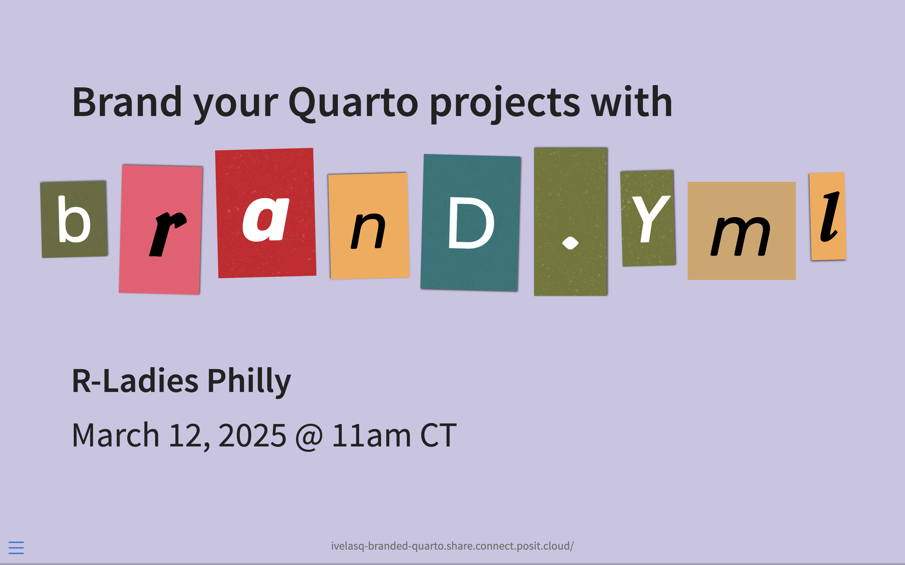

# Brand your Quarto Projects with brand.yml

## 2025-03-12 R-Ladies Philly

[Link to recording](https://www.youtube.com/watch?v=mTuhQ64P3qc)
[Link to slides](https://ivelasq-branded-quarto.share.connect.posit.cloud/#/section)

## Resources

* [brand.yml documentation site](https://posit-dev.github.io/brand-yml/)
  * [Creating a brand.yml with an LLM](https://posit-dev.github.io/brand-yml/articles/llm-brand-yml-prompt/)
* [Quarto documentation](https://quarto.org/docs/authoring/brand.html)
* [Unified branding across Posit tools with brand.yml](https://posit.co/blog/unified-branding-across-posit-tools-with-brand-yml/)
* [Company-branded reports, apps, and dashboards made easier with brand.yml & Posit ](https://www.youtube.com/watch?v=kuEbRfmm4G4)
  * [Live Q&A](https://www.youtube.com/watch?v=kuEbRfmm4G4)
